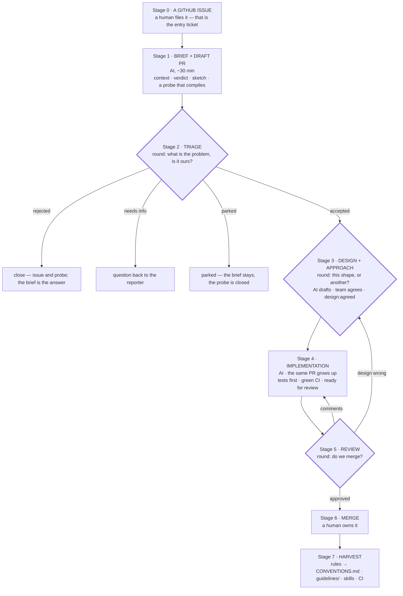

# AI-First Workflow for the Flow Team

**Status:** draft for team discussion.

Developers spend their time on **problems, design and decisions**. AI does the
**research, drafting, implementation, tests and revisions**.

**The process starts when a GitHub issue appears.** A human files it — deciding
that something deserves the team's attention is the entry ticket — and from that
moment automation moves it: a brief and a draft PR within the hour, revisions
after every decision. What the team supplies is decisions.

Two layers: how a **project** runs (a PRD becomes a shipped increment, §4) and
how an **issue** moves (a filed issue becomes a merged PR, §5–6). Companion to
[CLAUDE.md](CLAUDE.md), [CONVENTIONS.md](CONVENTIONS.md) and
[guidelines/](guidelines/overview.md), which hold the content; this holds the
process.

**Deliberately not covered yet:** where issues come from. Turning Slack threads,
forum posts and support tickets into issues — and noticing when five of them are
one problem — is a real problem and a separate one. This document assumes the
issue exists and is only about what happens next, because that is where we lose
the weeks.

---

## 1. Why

Four things eat most of our week:

1. **Research and design from a one-sentence ask** — days, sometimes months, of
   locating where it lands in Flow and reconstructing how that area works today,
   before any decision is possible.
2. **Reading the diff**, line by line, largely for mechanical correctness.
3. **Reviewing routine, high-volume changes** — bumps, refactors, migrations.
4. **Impact analysis, repeated per issue** — is this needed, what can it break.

Only a thin slice of that is judgement; the rest is legwork before it and volume
hiding it.

| Where the time goes | Judgement — **team** | Legwork — **AI** |
| --- | --- | --- |
| Design from a vague ask | Which design; what belongs in Flow | The area, prior art, drafting options |
| Reading the diff | Semantics, API, risk | Mechanical correctness — compiler, tests, linters |
| Routine bulk changes | Deciding a change *is* routine | Producing it, proving it was |
| "Needed? Breaks anything?" | The decision | Context and blast radius |

**AI does the legwork before the decision and the work after it. The team makes
the decision.** Cost of mistakes follows the same line: an implementation is
cheap to redo, a public API is not.

---

## 2. People file, automation moves, we decide

Automation is not a helper we invoke when we remember to. A new issue triggers
it, and it keeps going until it needs a decision — then it stops and says so.

**Automation does this without being asked:** reads the issue and everything
linked from it; labels it; points at likely duplicates; writes the Analysis
Brief; opens a draft PR with a reproducing test and the sketched API; keeps CI
green; revises on comment; drafts docs, demo and DX tests; keeps the board and
labels truthful; flags issues that have gone stale.

**A human decides, three times per issue:**

| # | Decision | Where | Label after |
| --- | --- | --- | --- |
| 1 | Is this a real problem, and is it ours? | Triage, in a round — §6 stage 2 | `accepted` / closed / `parked` / `needs-info` |
| 2 | Is this the design — the probe's shape, or another? | Design, in a round — §6 stage 3 | `design:agreed` |
| 3 | Do we merge, and who owns it afterwards? | Review, in a round — §6 stage 5 | merged |

Everything between and around those three is automation's. If an issue needs a
fourth decision, that is a signal, not a nuisance: either the brief was thin or
the design was never actually settled — say which, in the issue.

**Automation never** merges, never closes an issue as won't-fix, never declares
two issues duplicates on its own, never changes an agreed API contract, and
never rules its own deviation acceptable.

Everything automation produces before decision 2 is **disposable**, and that is
precisely what makes it safe to produce early.

---

## 3. Roles

A role is two things: **what you owe, and what others may demand of you.** We
usually write down only the first, which is why people know their tasks but not
what to expect from each other.

| Role | Owes | Others may demand |
| --- | --- | --- |
| **PM** — stakeholder, owns the PRD, never 100% on one project | Who the user is, what problem, why now, what success looks like; written answers within a day | Clarity about the *problem*, and a straight answer on whether something still serves it |
| **The team** — everyone else, 100% allocated | The shipped increment: design, code, tests, docs, demo, DX, quality, usability. Deciding *how*, and *how little* | That it decides and ships without being chased, and asks when the PRD is ambiguous |
| **Lead** — one per piece of work, on the team; *not* its implementer. The **project lead** on a project, the **issue lead** on a single issue — same role, different scope | That the work reaches decisions and goes in the right direction at the right pace: a prepared round, a truthful board, nothing left unowned, blocked people unblocked | Discussion opened early, an agenda before the round rather than at it, specific questions, a straight answer on what matters most right now, gaps named early rather than discovered late |
| **Consulted expert** — not on the team | Answers when asked | Nothing else — no deliverables, no attendance |

Where expectations quietly diverge today:

- **The PM is not QA.** Whatever the team ships is what users get. The PM may
  say *"this no longer solves the user's problem"* — that is PRD ownership. Not
  *"the quality bar is not met"* — that is ours.
- **The PM does not push work.** No assigning, no chasing, no status-collecting.
  Clarification is a **pull**: the team asks, the PM answers. If something needs
  chasing, we are missing a decision, not a chaser.
- **The lead is not the PM, and not a manager of people.** The PM watches that
  the business requirement is being fulfilled; the lead watches that the work is
  going in the right direction and on time. Neither of them decides the design —
  the round does.
- **The team connects the PRD to the work.** Nobody else spans that gap.
- **Nobody is "partly" on the team.** Partial membership is worse than absence:
  it blurs who owes what and leaves work half-done. If you cannot be 100%, you
  are a consulted expert — a real role with clear expectations.

**The lead** takes a piece of work and carries it to the end — a whole project,
or a single issue from problem to merge. It is one role at two scales: on a
project we call it the project lead, on one issue the issue lead, and on a small
feature the two are the same person doing the same thing.

The lead does not build it — AI does — and is accountable for the outcome rather
than for having typed it. Nor is the lead licensed to decide alone: the design is
decided in the round. A lead often is not the person with the most scar tissue in
that area, and that is the point — it forces context out of one head.

What the role is, concretely:

- **Prepares every round.** Reads each brief and each draft PR beforehand and
  turns it into *one question with a recommendation*. The pre-read is AI's job;
  the agenda is the lead's. **No agenda, no round** — the lead moves it and says
  so in advance, rather than convening a meeting nobody has thought about.
- **Opens the discussion early**, at revision 1 — a polished revision 4 reads as
  a fait accompli and gets worse input.
- **Asks sharp questions instead of open ones.** "Should detach cancel the
  pending update or queue it?" gets a decision where "thoughts?" gets silence.
- **Pulls in people by name**, and records every conclusion in the issue.
- **Watches direction and pace**, not just progress: are we building the right
  thing in the right order, is anything unowned, has someone been quietly stuck
  for two days, will this land on time — and says so early rather than at the end.
- **Keeps the board honest** and runs the round.
- **Decides alone only in the gaps between rounds**, marking it as unilateral.
  Reopen such a decision with an argument, not with a delay.

Leads rotate. On a project the lead is fixed for its duration.

---

## 4. Running a project

**A product is what the user can do, not what we implemented.** So the unit of
planning is a **use case**; *done* means a user can do it — API that reads well
from outside, docs, sane errors, a demo — not "the PRs are merged"; progress is
reported as capabilities gained; and quality and usability are ours, because
they are the product.

**Kickoff (day 0).** The PM presents the PRD. The team asks anything. **No
estimates, no scope commitment** — nobody understands the problem yet. Output:
the roster (100% each) and the first written questions to the PM.

**Days 0–2.** AI produces an Analysis Brief (§6) per candidate use case: where
it lands, how that area works today, what supporting it would cost.

**Day 2 — the scope meeting.** The team agrees the **Use Case List**: what we
will support, and what we identified and deliberately will **not**, one line of
why each. The second list carries as much weight as the first — it makes
"minimal" checkable and stops us re-litigating scope on day nine. The PM answers
questions and says whether the scope still fulfils the PRD; the team decides what
it builds.

**Every use case is an issue**, and from then on it moves exactly like any other
issue (§5–6): brief, draft PR, three decisions. The project layer decides *what*
we take on; the issue layer moves each piece.

**Minimal by default.** Build the least that fulfils the PRD. Ideas that emerge
mid-project go to the **parking lot** — one line, who raised it, why it looked
good — and **nobody starts on a parked idea**. At the end it is filed as an
issue like anything else. Good ideas are not the problem; good ideas started
quietly are.

**Rituals.** The project has its own round (§5); members **skip their home
team's ceremonies** while on it — two rhythms is what makes 100% impossible. The
PM sees a working walkthrough weekly, to confirm we are solving the right
problem, not to accept or reject the work.

**The board.** Every task has a ticket, and the board is public and truthful: at
any moment anyone can see what is in progress, what is done, and what nobody has
picked up. Knowing what to do next should never require asking someone.

**Done does the reminding.** Demos, docs and DX tests get dropped because they
are tracked apart from the code and postponed one day at a time. So they belong
to the use case's definition of done — a use case with merged code and no docs is
*not done*, and the board shows it as not done. Nobody has to chase work that
cannot be marked complete without it.

**The lead does what structure cannot** (§3). A definition of done stops work
being forgotten; it cannot tell whether we are building the right thing in the
right order. What the lead does *not* do is remind people to write documentation
— that is the definition of done's job, and if it needed reminding we would not
really consider it part of the work.

---

## 5. The issue and the round

**The issue is the unit.** One issue is one problem, and the brief, the design
note, every decision and the PR all hang off it; duplicates are closed onto it
rather than discussed twice. It is named as **the problem in the user's words** —
*"Grid loses selection after a refresh"*, not *"add a keepSelection flag"*.

It stays **one continuous discussion, from the problem to the merge decision.**
The issue holds the record, the PR holds the code, and both exist from the first
hour — so there is never a moment where the conversation moves house, drops half
its context and restarts in front of a different audience.

**The round.** The whole team walks the live issues together, daily, 30 minutes,
run by the lead; an issue that needs no decision takes ten seconds. **The round
is where decisions happen; between rounds automation does the work.** During a
project the round is the daily and the issues are the use cases — one ritual, not
two.

| Issue state | The question the round answers |
| --- | --- |
| `new` — brief and draft PR already attached | What is the problem, and is it ours? (not: what do we build) |
| `accepted` | What is the design — this shape, or another? And how do we build it? |
| `design:agreed` | Nothing. AI is finishing it; speak only if it is blocked |
| `in review` | Do we merge? |

- **Problem before solution, always** — *even though a PR is already open.* The
  draft PR is evidence about the problem, not a proposal awaiting approval. An
  issue may not be discussed as an implementation until the team has said out
  loud what the problem is. Most disagreements about *how* are unnoticed
  disagreements about *what*.
- **No unprepared round.** Everyone arrives having read the brief; the lead
  arrives with an agenda — one question per issue, each with a recommendation.
  A round without one is moved, not endured.
- **Design and implementation in one pass.** The same conversation settles the
  design *and* the approach, so AI goes straight from the round to a finished
  PR. Splitting across two rounds is the exception, for genuinely new ground.
- **Progress is never reported aloud** — it lives in the issue. That is what
  keeps this from becoming a status meeting.

Target: **agreed in the first round that sees it, merged in the next.**

| Step | Target | Limit |
| --- | --- | --- |
| Issue filed → brief + draft PR | 30 min | 2 h |
| Brief → first round | next round | 1 day |
| Problem agreed → design agreed | same round | 2 rounds |
| Design agreed → PR ready for review | 1–4 h | 1 day |
| Ready → merge decision | next round | 2 rounds |
| **Issue filed → merged** | **2 rounds** | **4 rounds** |

Counting in rounds is deliberate: "this issue has taken four rounds" is harder
to ignore than "it has been a few days".

---

## 6. The pipeline



The three thick-bordered stages are the three decisions (§2) — one conversation,
continued. Everything else happens between rounds. The same pipeline in plain
text, for editors that do not render Mermaid:

```text
  Stage 0  A GITHUB ISSUE ....... a human files it; the problem, in their words
                                │
                                ▼
  Stage 1  BRIEF + DRAFT PR .......................... AI, ~30 min
           brief: context · verdict · sketch · confidence
           probe: reproducing test · sketched API · CI blast radius
                                │
                                ▼
  Stage 2  TRIAGE ......... round: what is the problem, and is it ours?
              ├── rejected ...... close issue and probe; the brief is the answer
              ├── needs info .... question back to the reporter
              ├── parked ........ the brief stays as the record
              └── accepted
                                ▼
  Stage 3  DESIGN + APPROACH ... round: this shape, or another? And how?
           AI drafts · team agrees · design:agreed
                                ▼
  Stage 4  IMPLEMENTATION ............................ AI
           the same PR grows up · tests first · green CI · ready for review
                                ▼
  Stage 5  REVIEW ...................... round: do we merge?
              ├── comments ...... back to Stage 4
              ├── design wrong .. back to Stage 3
              └── approved
                                ▼
  Stage 6  MERGE ..................................... a human owns it
                                ▼
  Stage 7  HARVEST ................................... rules → CONVENTIONS.md,
                                                       guidelines/, skills, CI
```

**0 · The issue.** Anyone files it — team, support, PM, a user. What a filer owes
is **the problem, not a solution**; a proposed API is welcome as a hint, but the
first line has to say what somebody could not do. AI reacts to the new issue
immediately: reads it and everything linked from it, labels it, and *points at*
likely duplicates without closing anything.

**1 · Brief and draft PR** (AI, ~30 min). One reaction, two artefacts:

- the **Analysis Brief** as an issue comment — context, verdict, sketch, and what
  it could not verify. It is the pre-read that makes a round possible;
- a **draft PR** — a probe: a test that reproduces the problem (failing), the
  sketched API compiling, and CI showing what else moves.

**Why the PR exists before any decision.** A brief can claim "two lines in
`Element`" and be wrong; a branch that compiles states what the change actually
costs, and CI turns blast radius from an estimate into a list of names. It also
gives the round something concrete to react to, and reacting is far easier than
originating (§9). If the round agrees with the shape we are already at review; if
it does not, we close a branch — the cheapest artefact we produce.

The probe is **a draft**, labelled `probe`, and refs the issue rather than
`Fixes`-ing it, so nothing closes by accident. Its description says what it does
*not* settle, and the brief still carries the alternatives AI did not build —
otherwise the one shape that exists wins by default.

**2 · Triage** — clear rejections the lead makes alone; everything else goes to a
round. Shallow on purpose: "worth our design time?", not "is this right?".
Rejecting closes the probe with the issue, and that is an ordinary Tuesday, not
waste.

**3 · Design and approach** — the design note is what the team argues about; the
probe is exhibit A, not the proposal. *"@claude, rework it: use an event instead
of a callback, and define what happens on detach."* Every conclusion lands back
in the note, with a one-line "what changed and why" per revision. **Right
problem, wrong shape** is a first-class outcome: the probe is discarded and the
next revision starts from the design, not from the code that happens to exist.

**4 · Implementation** (AI) — the same PR grows up against the agreed note: tests
first (if they expose a design problem, **go back to Stage 3** rather than bend
the tests), green CI, a description reviewable without the diff, and **every
deviation from the note declared**. An undeclared deviation is the worst failure
mode of this process. Because the branch predates the design, the PR also says
**which parts of the probe survived the decision** — code that is there because
it was there on day one is the failure mode of starting early.

**5 · Review** — read the description: does it solve the problem? Is the API what
we agreed, and what we want to live with? What happens at the edges — null,
detach, concurrency, serialization, back-compat? Are the tests aimed at
behaviour? What is the blast radius? Comment in the PR, `@claude` revises;
reviewers do not push fixes themselves, because asking keeps the rule
harvestable. Anything with design content is decided in the round by the people
who agreed the design; small and routine changes async. Bouncing back to Stage 3
is a success, not a failure.

**6 · Merge** — approving means *"I understand this and I am comfortable owning
it."* Never approve to unblock someone.

**7 · Harvest** — a recurring comment becomes a rule in `CONVENTIONS.md` or a
chapter in `guidelines/`, a recurring analysis becomes a skill, a recurring check
becomes a CI check. This is what makes the next cycle shorter than this one.

---

## 7. Templates

```markdown
ANALYSIS BRIEF
## Context     Area · how it works today · why · related API and decisions
## Verdict     accept / reject / needs info / park — why · alternatives
               (userland, add-on, docs) · cost of accepting
## Sketch      proposed API (signatures, no bodies) · affected modules ·
               lifecycle & threading · open questions for the team
## Confidence  verified: <what I read or ran>   assumed: <what I did not>
```

```markdown
DRAFT PR — opened with the issue, before any decision
## Problem                 one paragraph, user-facing; link to the issue
## What this probe shows   the reproducing test · the API as it would read ·
                           what CI says breaks · what the change costs
## What it does not settle the design is open; alternatives are in the brief
## Discard it if           the condition under which this shape is wrong
Refs #<issue>              — deliberately not "Fixes"
```

```markdown
DESIGN NOTE — Revision N; "changed in this revision" in one line
## Problem                 user-facing, not the solution
## Goals / Non-goals
## Proposed design         API with signatures and contracts
## Behaviour               lifecycle, threading, null, errors, edge cases
## How we will build it    approach, main pieces, anything AI needs decided
## Alternatives rejected   option — why not. This section is the point.
## Compatibility · Testing strategy · Risks
```

```markdown
PR DESCRIPTION — when it is ready for review
## What · Why              user-facing paragraph; link to the issue
## Design                  link to the agreed note + 5–15 lines restating it
## How it is implemented   which class does what; the non-obvious decisions.
                           Enough to review without opening the diff.
## From the probe          what survived the design decision, and what was cut
## Deviations from the note   none / list, with reasons
## Testing                 covered, and deliberately not covered
## Risk & blast radius     what breaks if this is wrong; how we would notice
Fixes #<issue>
```

---

## 8. What replaces line-by-line review

The real gate is the design discussion; automated gates (build, tests, ITs,
`spotless`, `checkstyle`, API compatibility) are a precondition for review, not
its outcome. On top of that, **a human still reads the code** — mark the PR
`review:code-required` — when it touches:

- public API surface;
- security-sensitive paths: request handling, session, class-loading,
  deserialization, path resolution;
- the client-server protocol, `StateNode` / `StateTree`, anything crossing the
  wire;
- concurrency, `UI.access`, push;
- performance-critical paths, or any change justified by performance;
- anything AI flagged as uncertain, or that deviates from the note.

Plus **one random PR per week, read in full.** This is our calibration: it tells
us whether the descriptions we trust match the code. A mismatch is a process
incident — discuss it and fix the rule, do not quietly fix the PR.

---

## 9. Culture

- **Design is discussed, code is generated.** Code existing early does not make
  it the design. Arguing about code in a PR means we skipped a design
  discussion.
- **Nobody defends the probe.** It cost twenty minutes of machine time. If
  probes are almost never discarded, we are not designing — we are approving the
  first thing that compiled.
- **A PR must be reviewable without the diff.** If it is not, the description is
  the defect.
- **A human always decides** — three times per issue (§2), and never fewer. AI
  never merges, never closes as "won't fix", never changes an API contract on its
  own authority.
- **Never approve what you do not understand**, and own the merge afterwards.
  "The AI wrote it and CI was green" explains nothing.
- **Correct the constitution, not just the output.** Fixing the same thing twice
  by hand means we forgot Stage 7.
- **Reward good rejections.** An issue closed in an hour with a clear explanation
  is a first-class outcome.
- **No silent local rewrites.** If you take an issue over and write it yourself,
  say why — that is our best data about where this process is weak.

**Silence is our failure mode.** Our discussions rarely fail through conflict;
they fail through silence, reliably when we open an area nobody has seen before.
That silence is not agreement and not an absence of ideas — it is people waiting
until their thought is good enough to say. It never becomes good enough. Since
everything here runs on discussion, this is the habit that decides whether the
rest works.

- **Half-formed thoughts are the deliverable** of a design discussion, not a
  by-product. "I might be wrong, but…", "this worries me and I can't say why
  yet", "I don't understand this part" — the last one is the most useful
  sentence available and is almost never true for only one person.
- **Nobody defends "their" design.** It belongs to the team the moment it is on
  the screen. That is what makes it safe to attack, and safe to be wrong.
- **Everyone speaks before anyone concludes.** Passing is allowed; staying
  invisible is not. An issue that passes through a round in silence was decided
  by whoever spoke last, not by the team.
- **Nobody arrives cold.** Silence usually means nobody has context, and
  reacting is far easier than originating — which is what the brief and the probe
  are for. No brief, no design discussion; no agenda, no round.
- **Written threads are first-class**, not a fallback: the quietest person in a
  call often writes the sharpest thing in the thread.
- **A silent meeting is not diligence.** Ten minutes of only the lead talking
  ends the meeting; rebook it with a pre-read.

---

## 10. Adoption, signals, open questions

Adopt the **project layer (§4) whole** on the next project — roles, allocation
and rituals only work as a set. The **issue layer** can be phased: two weeks of
briefs only, then briefs plus probe PRs, then design notes, then the full
pipeline with spot-checks, and widen only while the spot-check mismatch rate
stays low. Review this document at the end of each phase.

Watch: rounds from filing to merge · share of issues agreed in the first round
that saw them · **spot-check mismatch rate** (the honesty metric) · **probes
discarded at design** (too low means we are rubber-stamping the first shape) ·
issues that needed a fourth decision · bounces back to design · rules added per
month · use cases done vs. agreed on day 2 · how much scope we managed *not* to
build · how many people spoke.

Still to decide:

1. Round cadence — daily 30 minutes, or three longer rounds a week?
2. **How many live issues can one round carry before it stops being a
   discussion?** That number, not the filing rate, is our real capacity.
3. Does *every* new issue get a probe PR, or only ones that pass triage? Probes
   are cheap in money and not free in attention.
4. Who owns an issue in its first hour? Something has to be the lead before the
   first round sees it — auto-assign by area, or whoever runs the next round?
5. Does the design note live in the issue, or as a file in the PR that reviewers
   can diff revision by revision?
6. Two days of understanding before the scope meeting fits a short project. What
   replaces it when the research alone has historically taken weeks — a longer
   day 2, or an explicit research phase with its own end date?
7. Does everyone attend every round — is it our only scheduled meeting?
8. Who becomes lead — rotation, whoever triaged it, or the area owner? And can a
   project lead also lead issues inside that project, or is that one head too
   many things?
9. Maintenance arriving mid-project: does the project team absorb it, or do we
   keep someone out of the project — which breaks the 100% rule?
10. PM says the agreed scope no longer fulfils the PRD and the team disagrees —
    who breaks the tie?
11. Do routine bulk changes need a **fast lane**: no design note, AI states the
    invariant it preserved and how it proved it, review is of the invariant?
12. Where do external contributor PRs enter — at review, or back at the problem?
13. Is one weekly spot-check enough — per team, or per person?
14. Design notes for bugfixes too, or is a probe with a failing test enough?
15. When is a stale probe closed, and by whom?
