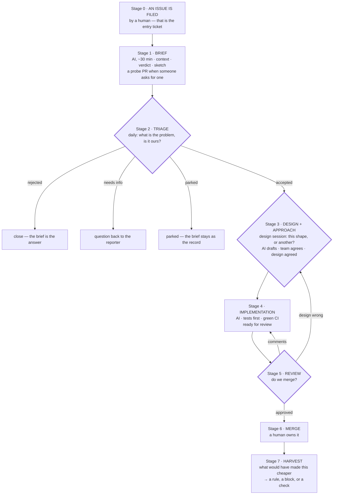

# AI-First Workflow for the Flow Team

**Status:** draft for team discussion.

Developers spend their time on **problems, design and decisions**. AI does the
**research, drafting, implementation, tests and revisions**.

**The process starts when a GitHub issue appears.** A human files it — deciding
that something deserves the team's attention is the entry ticket — and from that
moment automation moves it: a brief within the hour, a branch when we ask for
one, revisions after every decision. What the team supplies is decisions.

Two layers: how a **project** runs (a PRD becomes a shipped increment, §4) and
how an **issue** moves (a filed issue becomes a merged PR, §5–6). Our conventions
and guidelines hold the content of how we build; this holds the process.

**Deliberately not covered yet:** where issues come from — turning threads and
support tickets into issues, noticing that five of them are one problem, or
letting automation file its own. This document starts from an issue that exists,
because that is where we lose the weeks.

---

## 1. Why

Four things eat most of our week: **research and design from a one-sentence ask**
— days, sometimes months, of locating where it lands in Flow and reconstructing
how that area works today; **reading the diff** line by line for mechanical
correctness; **reviewing routine bulk changes** — bumps, refactors, migrations;
and **impact analysis repeated per issue** — is this needed, what can it break.
Only a thin slice of that is judgement; the rest is legwork before it and volume
hiding it.

| Where the time goes | Judgement — **team** | Legwork — **AI** |
| --- | --- | --- |
| Design from a vague ask | Which design; what belongs in Flow | The area, prior art, drafting options |
| Reading the diff | Semantics, API, risk | Mechanical correctness — compiler, tests, linters |
| Routine bulk changes | Deciding a change *is* routine | Producing it, proving it was |
| "Needed? Breaks anything?" | The decision | Context and blast radius |

**AI does the legwork before the decision and the work after it. The team makes
the decision.** Cost of mistakes follows the same line: an implementation is
cheap to redo, a public API is not.

---

## 2. People file, automation moves, we decide

Automation is not a helper we invoke when we remember to. A new issue triggers
it, and it keeps going until it needs a decision — then it stops and says so.

**Automation does this without being asked:** reads the issue and everything
linked from it; files it in the right area; points at likely duplicates; writes
the Analysis Brief with a proposed verdict; opens a probe PR when somebody asks
for one; keeps CI green; revises on comment; drafts docs, demo
and DX tests; keeps the board truthful; and writes the daily digest (§5), with
what needs our judgement at the top.

**What starts it is a state, not a person remembering.** A filed issue starts the
brief; an accepted problem starts the design note; an agreed design starts the
implementation; a question in the thread starts a revision. The state of an issue
is a switch rather than a sticker on a board — which is also why the board cannot
drift away from what is happening. The one thing automation does not start on its
own is a PR: a branch nobody asked for is a place in the review queue nobody
planned, and that queue is the scarcest thing we have.

**A human decides three times per issue:**

| # | What is decided | Where | State after |
| --- | --- | --- | --- |
| 1 | Is this a real problem, and is it ours? (not: what do we build) | the daily (§5) confirms what AI proposed | accepted · closed · parked · waiting on the reporter |
| 2 | What is the design — the probe's shape, or another? And how do we build it? | the design session (§5) | design agreed |
| 3 | Do we merge, and who owns it afterwards? | async by default; the daily when it is disputed | merged |

Between the second and the third nothing is asked of anyone: AI is finishing the
work, and we speak only if it is blocked. Everything around those three decisions
is automation's. If an issue needs a fourth, that is a signal — either the brief
was thin or the design was never settled; say which, in the issue.

**Automation never merges**, never closes an issue as won't-fix, never declares
two issues duplicates on its own, never changes an agreed API contract, and never
rules its own deviation acceptable. It approves in one place only — the fast lane
(§8), where we ruled in advance on a whole class of change. Everywhere else the
agent that wrote a change has no route to approving it, and the merge is always
somebody's.

**Nothing safe waits for permission:** building, testing and formatting are
approved in advance, because an agent idling on a prompt costs what a PR idling
on a reviewer costs. And everything automation produces before decision 2 is
**disposable** — which is exactly what makes it safe to produce early.

---

## 3. Roles

A role is two things: **what you owe, and what others may demand of you.** We
usually write down only the first, which is why people know their tasks but not
what to expect from each other.

| Role | Owes | Others may demand |
| --- | --- | --- |
| **PM** — stakeholder, owns the PRD, never 100% on one project | Who the user is, what problem, why now, what success looks like; written answers within a day | Clarity about the *problem*, and a straight answer on whether something still serves it |
| **Engineering manager** — owns the process, never 100% on a project | That decisions happen: nothing waits with no owner, a stuck one gets escalated or taken. The schedule and what we promised outward. Who is on which project, leads rotating, the 100% rule staying true. That this document is followed — and changed when reality says it is wrong. People: workload, growth, somebody drowning quietly | A decision when one is stuck and nobody owns it; a straight answer on dates and on what matters most; being unblocked on what the team cannot unblock itself — people, access, another team; being shielded from work nobody agreed to |
| **The team** — everyone else, 100% allocated | The shipped increment: design, code, tests, docs, demo, DX, quality, usability. Deciding *how*, and *how little* | That it decides and ships without being chased, and asks when the PRD is ambiguous |
| **Lead** — one per piece of work, on the team; *not* its implementer. The **project lead** on a project, the **issue lead** on a single issue — same role, different scope | That the work reaches decisions and goes in the right direction at the right pace: a prepared meeting, a truthful board, nothing left unowned, blocked people unblocked | Discussion opened early, an agenda before the meeting rather than at it, specific questions, a straight answer on what matters most right now, gaps named early rather than discovered late |
| **Consulted expert** — not on the team | Answers when asked | Nothing else — no deliverables, no attendance |

Where expectations quietly diverge today:

- **The PM is not QA.** Whatever the team ships is what users get. The PM may
  say *"this no longer solves the user's problem"* — that is PRD ownership. Not
  *"the quality bar is not met"* — that is ours.
- **The PM does not push work.** No assigning, no chasing, no status-collecting.
  Clarification is a **pull**: the team asks, the PM answers. If something needs
  chasing, we are missing a decision, not a chaser.
- **The lead is not the PM, and not a manager of people.** The PM watches that
  the business requirement is being fulfilled; the lead watches that the work is
  going in the right direction and on time. Neither of them decides the design —
  the design session does.
- **The team connects the PRD to the work.** Nobody else spans that gap.
- **Nobody is "partly" on the team.** Partial membership is worse than absence:
  it blurs who owes what and leaves work half-done. If you cannot be 100%, you
  are a consulted expert — a real role with clear expectations.
- **The engineering manager is the one exception**, and only as lead: leading is
  not implementing, so it fragments nobody's delivery. The obligations come
  whole, though — a prepared meeting, a truthful board, decisions reached — and
  an engineering manager who cannot meet them hands the lead role to someone who
  can, rather than holding it at half strength.
- **The engineering manager does not decide design or scope.** Design is the
  session's, scope is the PM's and the team's. What the engineering manager
  decides is that a decision gets made at all, and by whom.

**The lead** carries one piece of work to the end. The lead does not build it —
AI does — and is accountable for the outcome rather than for having typed it, and
does not decide the design alone: that happens in the session. A lead often is
not the person with the most scar tissue in that area, and that is the point —
it forces context out of one head. Concretely:

- **Prepares every meeting.** Reads the digest, each brief and each draft PR
  beforehand and turns it into one question with a recommendation. The pre-read
  is AI's job, the agenda is the lead's — **no agenda, no meeting.**
- **Opens the discussion at revision 1** — a polished revision 4 reads as a fait
  accompli and gets worse input — and asks sharp questions instead of open ones:
  "should detach cancel the pending update or queue it?" gets a decision where
  "thoughts?" gets silence.
- **Watches direction and pace**, not progress: right thing, right order, nothing
  unowned, nobody quietly stuck for two days — said early, not at the end.
- **Keeps the board honest**, pulls people in by name, records every conclusion
  in the issue, and decides alone only between meetings, marked as unilateral.

**The lead's own work comes last.** Direction, pace and a prepared meeting are
the job; taking issues is what the lead does with the time left over, and the
first thing to drop when there is none — because the person who would notice
that preparation slipped is the lead. On a project of one or two people that is
not possible, and then the lead takes work too, but no more than half the time.

Leads rotate. On a project the lead is fixed for its duration.

---

## 4. Running a project

**A product is what the user can do, not what we implemented.** So the unit of
planning is a **use case**; *done* means a user can do it — API that reads well
from outside, docs, sane errors, a demo — not "the PRs are merged"; progress is
reported as capabilities gained; and quality and usability are ours, because
they are the product.

**Kickoff (day 0).** The PM presents the PRD. The team asks anything. **No
estimates, no scope commitment** — nobody understands the problem yet. Output:
the roster (100% each) and the first written questions to the PM.

**Days 0–2 — understanding, not planning.** AI produces a brief (§6) per
candidate use case: where it lands, how that area works today, what supporting it
would cost. The team reads them next to the PRD, gets into the context, and comes
out with the open questions written down and an opinion ready for the scope
meeting. Nobody arrives at day 2 to be informed. In unfamiliar ground this takes
longer than two days — what matters is the output, not the number.

**Day 2 — the scope meeting.** The team agrees the **Use Case List**: what we
will support, and what we identified and deliberately will **not**, one line of
why each. The second list carries as much weight as the first — it makes
"minimal" checkable and stops us re-litigating scope on day nine. The PM says
whether the scope still fulfils the PRD; the team decides what it builds. Every
use case on the list is an issue, and moves like any other one (§5–6).

**Minimal by default.** Ideas that emerge mid-project go to the **parking lot** —
one line, who raised it, why it looked good — and **nobody starts on a parked
idea**; at the end it is filed as an issue like anything else. Good ideas are not
the problem; good ideas started quietly are.

**The project team solves the project's problems.** Whatever arrives while the
project runs — bugs, regressions, escalations in the areas it touches — is
absorbed by the people on it. Nobody is kept outside the project to catch it and
nothing is handed to another team. The consequence is stated rather than hidden:
the scope agreed on day 2 is what the team can do *including* the incoming, and
when the incoming starts eating the project, it shows up in the daily instead of
in a missed date.

**The PM sees a working walkthrough weekly** — to confirm we are solving the
right problem, not to accept or reject the work.

**Done does the reminding.** Demos, docs and DX tests get dropped because they
are tracked apart from the code and postponed one day at a time. So they belong
to the use case's definition of done — a use case with merged code and no docs is
*not done*, and the board shows it that way. Nobody chases work that cannot be
marked complete without it, and the lead's job is the part structure cannot do
(§3): whether we are building the right thing in the right order.

---

## 5. The issue, the daily and the design session

**The issue is the unit.** One issue is one problem, and the brief, the design
note, every decision and the PR all hang off it; duplicates are closed onto it
rather than discussed twice. It is named as **the problem in the user's words** —
*"Grid loses selection after a refresh"*, not *"add a keepSelection flag"*.

It stays **one continuous discussion, from the problem to the merge decision.**
The issue holds the problem and the decisions; everything that changes as the
work does lives in the PR — so the conversation never moves house and restarts
with half its context. The brief and the design note are committed documents
rather than comments: they sit in the probe PR when there is one and in a PR of
their own when there is not, so revision 4 arrives as a diff against revision 3.
They stay after the merge: a searchable answer to "why does this API read like
this", and the raw material for harvesting (§6 stage 7).

**The board, and nobody's name on it.** An issue moves *needs triage → needs
design → ready to go → in progress → on review → done*, and skips *needs design*
when there is nothing to design. Until someone picks it up it belongs to the
board, not to a person: we do not assign work, we make it possible to take, and
knowing what to do next never requires asking someone. The person who takes it
becomes its lead (§3); before that, an issue has no owner and needs none.

**Status is written, not spoken.** Everyone posts their update in the team
channel before the daily, prompted by a bot. Updates are nearly always trivial,
and trivia is what used to eat our meetings.

**The daily — 60 minutes, the whole team.** It opens with a round table that is
dynamic: anyone with something that needs a reaction takes a turn — a PR that
needs eyes, a research question they are stuck on, a new issue worth explaining
before it comes back. Some days that is everybody, some days nobody. Then we walk
the digest from the top. Some days nothing has arrived and it takes five minutes;
some days thirty issues have, and then we talk through the top of the list while
the rest is confirmed in bulk. The hour is fixed; what fills it is not.

**The digest is what makes that possible.** AI writes it shortly before the
daily, and it is a list of decisions rather than a news feed:

- **blockers** first, even when the fix is five minutes — somebody is stopped;
- **the review queue** in one line: how long it is, how old the oldest is. When
  it is long, the daily spends itself on reviews rather than on new issues;
- **needs judgement** — what AI could not settle on its own, ordered by how much
  judgement it takes: disagreement in the thread, public API, no precedent in the
  code, wide blast radius, or AI's own confidence being low;
- **routine** — verdicts to confirm in bulk, and everything else to read on your
  own, never aloud.

It also routes: a PR that touches the area of an earlier one says so, with the
name of whoever reviewed that one. That is how work someone has already touched
finds the person who touched it, without anyone reporting it.

**The design session — once a week, two blocks of 45 minutes with a break.**
Anything with design content goes to the *needs design* column and waits for the
session; three or four topics. Design is the decision we least want taken in a
hurry, and the one place where the whole team in one room is worth what it costs.
Preparation is what keeps it to 90 minutes:

- **AI publishes the material a day ahead** — background, the options, what each
  costs — and refreshes it an hour before if anything moved.
- **Someone other than the author opens each topic**, picked at random the day
  before: they read the material and put it in their own words — the problem, the
  options, what speaks for and against each. Somebody besides the author having
  understood it before the meeting is the point.
- **The lead brings the question and a recommendation.** Between sessions the
  lead may settle a small design question alone, marked as unilateral — that is
  what keeps a two-minute question from waiting a week.

During a project the daily and the design session are the project's, and members
skip their home team's ceremonies — two rhythms is what makes 100% impossible.

- **Problem before solution, always** — *even when a PR is already open.* The
  probe is evidence about the problem, not a proposal awaiting approval. An
  issue may not be discussed as an implementation until the team has said out
  loud what the problem is. Most disagreements about *how* are unnoticed
  disagreements about *what*.
- **No unprepared meeting.** Everyone arrives having read the digest or the
  pre-read; the lead arrives with an agenda — one question per item, each with a
  recommendation. A meeting without one is moved, not endured.
- **Only what someone can act on gets said out loud.** A PR: explain in a few
  sentences what it does, so whoever reviews it starts warm. A new issue: explain
  the problem, so the team recognises it when it comes back. Research: ask the
  question you are stuck on. Everything else is written down already — when
  nothing is required of the room, the room stops listening.
- **Design and implementation in one pass.** The same session settles the design
  *and* the approach, so AI goes straight from it to a finished PR. Splitting
  across two sessions is the exception, for genuinely new ground.
- **Two or three issues per person, then stop adding.** Running more agents at
  once is nearly free; reading what they produce is not. The limit is the person
  steering, not the machine.

| Step | Target | Limit |
| --- | --- | --- |
| Issue filed → brief | 30 min | 2 h |
| Brief → first daily | next daily | 1 day |
| Problem agreed → design agreed | next design session | 2 sessions |
| Design agreed → PR ready for review | 1–4 h | 1 day |
| Ready → merge decision | 1 day | next daily |
| **Filed → merged, no design needed** | **2 dailies** | **1 week** |
| **Filed → merged, design needed** | **1 week** | **2 weeks** |

Counting in meetings is deliberate: "this has waited two design sessions" is
harder to ignore than "it has been a couple of weeks".

---

## 6. The pipeline

The three thick-bordered stages are the three decisions (§2). Everything else
happens between meetings, without us.

**0 · The issue.** Anyone files it — team, support, PM, a user. What a filer owes
is **the problem, not a solution**; a proposed API is welcome as a hint, but the
first line has to say what somebody could not do.

**External contributors have two doors.** Something small and obviously right —
a typo, documentation, a one-line bug with a test — goes straight to review;
filing an issue for it would be theatre. Anything larger enters at the problem:
the PR stays open, but what we discuss first is whether this is the problem we
want solved, with their diff serving as a free probe — it already shows the cost
and the blast radius. They get an answer within one daily, and that is a promise,
because the alternative is silent neglect. If the design we agree matches what
they wrote, review proceeds normally; if it does not, we say what we would take
instead, and they decide whether to rework it or hand it over.

**1 · Brief** (AI, ~30 min), **and a probe PR when a human asks for one.** Every
issue gets a brief automatically; none gets a branch automatically, because a
thirty-issue day would leave thirty PRs in a queue we cannot read. Asking for a
probe costs one line, and is worth it for a bug — the reproducing test *is* the
triage, and settles "is this real?" better than a discussion — and for anything
whose cost the brief cannot guess. For a feature or an API change it waits until
the problem is accepted.

The **brief** carries context, verdict, sketch, and what it could not verify: the
pre-read that makes a decision possible. The **probe** is a failing test that
reproduces the problem, the sketched API compiling, and CI showing what else
moves.

**Why a probe is worth opening before the decision.** A brief can claim "two
lines in one class" and be wrong; a branch that compiles says what the change
costs, and CI turns blast radius from an estimate into a list of names. If the
shape survives the design session we are already at review; if it does not, we
close a branch — the cheapest artefact we make. The probe states what it does
*not* settle, and the brief still carries the alternatives AI did not build. One
left undecided for a week is closed automatically, with a line in the issue:
reopening a branch costs nothing, an open PR nobody decided about costs attention
every day.

**2 · Triage** — AI proposes a verdict in the brief and the daily confirms it in
bulk, stopping only where someone objects. The question is shallow on purpose:
"worth our design time?", not "is this right?". Rejecting closes the probe with
the issue — an ordinary Tuesday, not waste.

**3 · Design and approach** — not every issue comes here. A bugfix whose expected
behaviour is not in doubt skips it: the failing test *is* the specification, and
the PR description carries the rest. It does need a note when the fix changes
behaviour somebody could depend on, or when "what should it do instead?" has more
than one defensible answer — a design question in a bug's clothes. The tell is
quick: if a reviewer could disagree with the *expected value in the test* rather
than with the implementation, you have design on your hands.

For everything that does come here, the brief grows into the **design note** in
the same file, so every revision is a diff with a one-line "what changed and why",
and the current version is the file rather than the newest comment. The note is
what the team argues about; the probe is exhibit A, not the proposal.
*"Rework it: use an event instead of a callback, and define what happens on
detach."* Every conclusion lands back in the note. **Right problem, wrong
shape** is a first-class outcome: the probe is discarded and the next revision
starts from the design, not from the code that happens to exist.

**4 · Implementation** (AI) — the PR grows up against the agreed note: tests
first (if they expose a design problem, **go back to Stage 3** rather than bend
the tests), green CI, a description reviewable without the diff, and a line on
**which parts of the probe survived the decision** — code that is there because
it was there on day one is the failure mode of starting early.

**A deviation from the note is corrected in the note, in the same commit**, so a
change of plan arrives as a diff anyone can see rather than a paragraph at the
bottom of a description. Silent deviation is still the worst failure mode of this
process; it is now also the easiest to spot.

**Nothing reaches a human before the check has run.** Every issue has one
verification target and one quantifiable statement of done — the tests green, the
failing test from stage 1 now passing, compatibility unbroken — and AI shows the
output rather than asserting it. A fix therefore starts with a failing test, and
that test is then off limits: edits to it are blocked for the rest of the task,
so the check that proves the bug cannot be weakened into agreement. If the target
cannot be stated at all, the gap is in Stage 3, not here.

**5 · Review** — read the description: does it solve the problem? Is the API what
we agreed, and what we want to live with? What happens at the edges — null,
detach, concurrency, serialization, back-compat? What is the blast radius?
Comment in the PR and AI revises; reviewers do not push fixes themselves, because
asking keeps the rule harvestable. AI then carries the PR to the gate on its own,
sweeping unresolved comments and red checks until everything is green, and waits
there — the approval is not its to give. Anything with design content is decided
in the design session by the people who agreed the design; small and routine
changes async. Bouncing back to Stage 3 is a success, not a failure.

**6 · Merge** — approving means *"I understand this and I am comfortable owning
it."* Never approve to unblock someone: "the AI wrote it and CI was green"
explains nothing.

**7 · Harvest** — once a week, automation reads the review comments of the week,
finds what was said more than once, and opens a single PR that changes our
conventions and guidelines in one go. Nobody edits them in the middle of a
merge; the question *what would have made this cheaper?* is answered in bulk,
where a repetition is visible and a one-off is not. Each proposal comes as one
of three things, and choosing the right one matters more than the writing:

| Strength | Form | Use when |
| --- | --- | --- |
| advisory | a written rule or guideline AI reads before working | the default is clear, and real exceptions exist |
| enforced | an automatic block before the action | it must hold every time, and a violation is recognisable in advance |
| proved | a check that runs on every change | it must hold every time, and only running the code can show it |

**Prose cannot hold a rule that must always hold.** A convention that admits no
exception belongs in a block or a check; writing it down again, in bolder words,
is what we do instead of fixing it. A recurring piece of analysis becomes a
standing instruction AI loads by itself.

The weekly PR is read by a person — it changes how everything else gets written,
so it is design, not housekeeping, and it goes to the design session when it is
more than wording. It is also what the eval suite (§9) runs against.

---

## 7. The four artefacts

Formats belong somewhere else; what matters here is what each has to answer, and
that the next stage reads the previous one instead of starting over.

**The brief** — where this lands in Flow and how that area works today; a verdict
with the alternatives to accepting it, including solving it outside Flow; a
sketch of the API and what it touches; and, kept separate, what AI verified
versus what it assumed.

**The probe PR** — the problem in one paragraph; what the probe demonstrates; what
it does *not* settle; and the condition that would make this shape wrong.

**The design note** — the brief, one revision later: the problem in the user's
terms, goals and non-goals, the design and its contracts, behaviour at the edges,
how we intend to build it, and the alternatives we rejected with the reason for
each. That last part is the point of the document.

**The PR description** — enough to review without opening the diff: what and why,
the design it was built against, which piece does what, what survived from the
probe, the evidence that the check passed, what is tested and deliberately not,
and the blast radius.

Several mechanics here come from Anthropic's [AI-native SDLC
playbook](https://claude.com/blog/the-ai-native-sdlc-playbook), which keeps three
documents per change where we keep two.

---

## 8. What replaces line-by-line review

The real gate is the design discussion; the automated gates — build, tests,
formatting, API compatibility — are a precondition for review, not its outcome.
On top of that, **a human still reads the code**, and the PR is marked as
needing that, when it touches:

- public API surface;
- security-sensitive paths: request handling, session, class-loading,
  deserialization, path resolution;
- the client-server protocol, anything crossing the wire;
- concurrency and push;
- performance-critical paths, or any change justified by performance;
- anything AI flagged as uncertain, or that deviates from the note.

**Before any of that, AI reviews the PR**, and what it looks for is written down
rather than improvised per reviewer: the passes it makes — correctness,
security, the protocol and serialization, public API and back-compatibility, our
own conventions — the line between *important* and *nit*, a cap on nits per PR,
and what not to look at at all (generated sources, and anything the automated
gates already enforce). The findings inform the humans; they neither approve nor
block.

**Chore, test and refactor are approved automatically.** A PR of that type gets
its approval without a reviewer when all of this holds: nothing in the public API
changed and the compatibility check says so, no test was weakened, CI is green,
and it stays out of the areas listed above. What it must state is the invariant
it preserved — behaviour unchanged, only the call sites moved — how it was
preserved, and how that was proved. **Every place where the mechanical rule had
to be broken is listed, and a single exception takes the PR out of the lane** to
a reviewer; a long list means the change was never routine. Merging stays a
person's act: the approval is what stops these PRs from waiting in a queue they
have nothing to gain from. The judgement here is about the class of change, taken
once — and what keeps it honest is the weekly read below and the fact that a
revert is one command.

Plus **one random PR per week, read in full.** This is our calibration: it tells
us whether the descriptions we trust match the code. A mismatch is a process
incident — discuss it and fix the rule, do not quietly fix the PR, and turn that
case into a standing task in the eval suite (§9), so it cannot come back
unnoticed.

---

## 9. Testing what steers AI

Our conventions, our guidelines, the standing instructions AI loads for a task,
the automatic blocks — none of that is documentation. It is the program that
decides how every change here gets written, and until now we changed it without
knowing what the changes did: a rule added for one awkward case can quietly make
ten ordinary ones worse, and we find out a month later, by accident.

So **what steers AI is tested like code.** The tests are called evals; the set of
them is the suite.

- **A few dozen real tasks**, taken from issues we have already closed: the issue
  as it arrived, and what a good answer looks like — tests pass, the convention
  is followed, the API matches what we merged, nothing unrelated is touched.
- **It runs once a week, against the weekly harvest PR** (§6 stage 7), and that
  is the only place it has to run: nothing else changes what steers AI. The same
  run also catches the models changing under us while our own rules stand still.
- **The pass rate decides whether the harvest lands.** A rule that fixes one task
  and breaks four is visible before it is merged. That is the whole point.
- **Every process incident becomes a permanent task in it:** the weekly
  spot-check mismatch (§8), the bug that got through review, the convention AI
  kept ignoring.
- **Whoever takes the harvest PR that week owns the suite** — adds the new task,
  retires the ones whose expected answer the code has outgrown, and says which a
  red run means: bad rule, or stale eval.

It is the honest answer to *"is harvesting working?"* — Stage 7 adds rules, this
is what tells us a rule did what we hoped rather than making us feel organised.

---

## 10. Culture

- **Design is discussed, code is generated.** Code existing early does not make
  it the design. Arguing about code in a PR means we skipped a design
  discussion.
- **A PR must be reviewable without the diff.** If it is not, the description is
  the defect.
- **A human always decides** — three times per issue (§2), and never fewer. An
  automatic approval (§8) is a decision we took once about a class of change, not
  one AI took. Never approve what you do not understand, and own the merge
  afterwards.
- **Correct the constitution, not just the output.** Fixing the same thing twice
  by hand means we forgot Stage 7 — and a correction nobody tested is a hope,
  not a rule (§9).
- **Reward good rejections.** An issue closed in an hour with a clear explanation
  is a first-class outcome.
- **No silent local rewrites.** If you take an issue over and write it yourself,
  say why — that is our best data about where this process is weak.

**Silence is our failure mode.** Our discussions rarely fail through conflict;
they fail through silence, reliably when we open an area nobody has seen before.
That silence is not agreement and not an absence of ideas — it is people waiting
until their thought is good enough to say. It never becomes good enough. Since
everything here runs on discussion, this is the habit that decides whether the
rest works.

- **Half-formed thoughts are the deliverable** of a design discussion, not a
  by-product. "I might be wrong, but…", "this worries me and I can't say why
  yet", "I don't understand this part" — the last one is the most useful
  sentence available and is almost never true for only one person.
- **Nobody defends "their" design, or their probe.** It belongs to the team the
  moment it is on the screen — that is what makes it safe to attack, and safe to
  be wrong. If probes are almost never discarded, we are not designing; we are
  approving the first thing that compiled.
- **Everyone speaks before anyone concludes.** Passing is allowed; staying
  invisible is not. An issue that passes through a meeting in silence was decided
  by whoever spoke last, not by the team.
- **Nobody arrives cold.** Silence usually means nobody has context, and
  reacting is far easier than originating — which is what the brief and the probe
  are for. No brief, no design discussion; no agenda, no meeting.
- **Written threads are first-class**, not a fallback: the quietest person in a
  call often writes the sharpest thing in the thread.
- **A silent meeting is not diligence.** Ten minutes of only the lead talking
  ends the meeting; rebook it with a pre-read.

---

## 11. Adoption, signals, open questions

Adopt the **project layer (§4) whole** on the next project — roles, allocation
and rituals only work as a set. The **issue layer** can be phased: two weeks of
briefs only, then briefs plus probe PRs, then design notes, then the full
pipeline with spot-checks and a written review policy, and the eval suite (§9)
from the first weekly harvest onwards. Widen only while the spot-check mismatch
rate stays low, and review this document at the end of each phase.

**What to watch.** Fast signals say the process is moving; slow ones say it was
worth moving. A fast signal that looks good while its slow partner rots is the
thing to catch.

| What | Fast — visible this week | Slow — visible over months |
| --- | --- | --- |
| Filing → decision | hours from filing to brief and probe · brief to first daily | issues that needed a fourth decision |
| Design | share agreed in the first session that saw them · **probes discarded at design** (near zero means we rubber-stamp the first shape) | bounces back to design after review |
| Implementation | first-pass CI success · issues one person steers at once while review holds | rework per merged change |
| Review | time to the first AI review · comments resolved without a human touching the branch | defects found before merge vs. after release |
| Steering files | eval pass rate on the weekly harvest · time from a process incident to an eval | **spot-check mismatch rate** (the honesty metric) · rules added per month |
| Project | use cases done vs. agreed on day 2 | how much scope we managed *not* to build · how many people spoke |

**Still to decide:** every question this draft opened with now has an answer
above. New ones belong here — an empty list means the document is young, not
finished.
